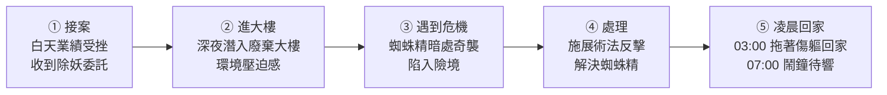

# 第 01 章：蜘蛛精

## 🎬 章節節奏結構圖

```mermaid
flowchart LR
    B1["① 接案<br/>白天業績受挫<br/>收到除妖委託"] --> B2["② 進大樓<br/>深夜潛入廢棄大樓<br/>環境壓迫感"]
    B2 --> B3["③ 遇到危機<br/>蜘蛛精暗處奇襲<br/>陷入險境"]
    B3 --> B4["④ 處理<br/>施展術法反擊<br/>解決蜘蛛精"]
    B4 --> B5["⑤ 凌晨回家<br/>03:00 拖著傷軀回家<br/>07:00 鬧鐘待響"]
```

---

## ✍️ 正文草稿

### ① 接案

（在此開始撰寫正文...）

### ② 進大樓

（在此開始撰寫正文...）

### ③ 遇到危機

（在此開始撰寫正文...）

### ④ 處理

（在此開始撰寫正文...）

### ⑤ 凌晨回家

（在此開始撰寫正文...）
